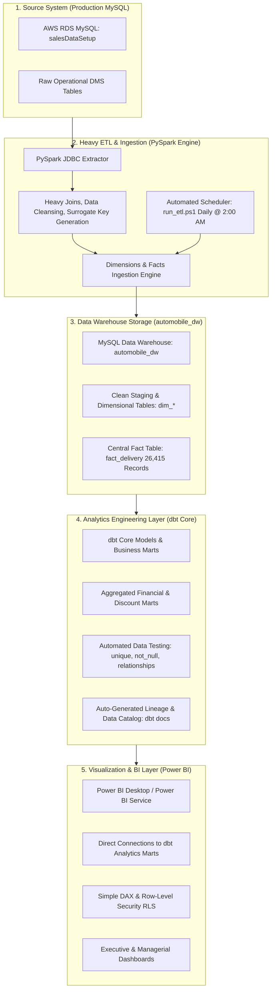

# End-to-End Automobile Data Engineering & Analytics Architecture (with dbt Core)

This document details the complete end-to-end architecture incorporating **PySpark ETL**, **MySQL Data Warehouse**, **dbt Core (Data Marts & Testing)**, and **Power BI Analytics**.

---

## 📐 Modern Data Stack Architecture Diagram



---

## ⚖️ Division of Responsibilities

### 1. PySpark → Ingestion, Heavy Computing & Cleansing
- **Extracts** high-volume operational logs from AWS RDS MySQL.
- **Handles** distributed joins, whitespace sanitization, case-insensitive deduplication, and surrogate key indexing.
- **Loads** raw sanitized dimensions (`dim_*`) and core fact tables (`fact_delivery`) into `automobile_dw`.

### 2. dbt Core → Business Modeling, Data Marts & Data Testing
- **Transforms** core warehouse tables into refined, business-ready analytical data marts (e.g. `marts/fct_sales_summary`, `marts/dim_dealership_performance`).
- **Tests** data quality with automated assertions (`not_null`, `unique`, `accepted_values`, foreign key `relationships`).
- **Documents** data lineage and maintains an interactive web Data Catalog (`dbt docs generate`).
- **Rolls up** complex financial measures (OEM vs. Dealer discount shares, delivery ageing buckets, profit margins).

### 3. Power BI → Visualization, Security & Interaction
- **Connects** directly to clean, curated dbt business marts in `automobile_dw`.
- **Renders** executive dashboards, interactive visual filters, and drill-through reports.
- **Enforces** Row-Level Security (RLS) for dealership managers and sales teams.

---

## 🚀 How to Add dbt Core to This Project

We can initialize a dbt project in `dbt_automobile_dw/` with the following structure:

```text
dbt_automobile_dw/
├── dbt_project.yml
├── profiles.yml
├── models/
│   ├── staging/
│   │   ├── stg_fact_delivery.sql
│   │   └── stg_dim_dealer.sql
│   └── marts/
│       ├── fct_sales_performance.sql
│       ├── fct_discount_analysis.sql
│       └── dim_executive_summary.sql
└── tests/
    └── assert_positive_margin.sql
```
