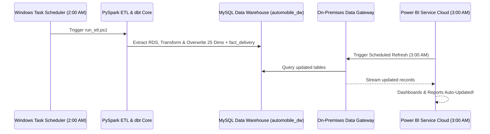

# Power BI Service Auto-Refresh & Incremental Refresh Architecture

This guide explains how to set up **Automated Scheduled Refresh** and **Incremental Refresh** in **Power BI Service** for your MySQL Data Warehouse (`automobile_dw`).

---

## 🔄 1. How Auto-Refresh Works in Power BI Service

Since your Data Warehouse (`automobile_dw`) is hosted on your local MySQL server, Power BI Service (in the cloud) requires an **On-Premises Data Gateway** to connect securely.

### **Daily Automated Refresh Sequence**:

### **Steps to Enable Scheduled Auto-Refresh**:
1. Download & Install the **On-Premises Data Gateway (Standard Mode)** on your server machine.
2. In Power BI Service (`app.powerbi.com`), register your MySQL `127.0.0.1:3306` dataset under **Manage Gateways**.
3. Under Dataset Settings, turn on **Scheduled Refresh** and set execution times (e.g. Daily at `03:00 AM`).

---

## ⚡ 2. How Incremental Refresh Works in Power BI Service

By default, Full Import mode re-downloads all 26,415+ records during every refresh. **Incremental Refresh** optimizes this by only pulling newly added or updated delivery rows (e.g. last 7 to 30 days) while keeping historical years cached in Power BI!

### **Steps to Enable Incremental Refresh**:

#### Step 1: Create Parameters in Power BI Desktop
In Power Query Editor, create two mandatory parameters (case-sensitive):
- `RangeStart` (Date/Time type, default e.g. `2022-01-01 00:00:00`)
- `RangeEnd` (Date/Time type, default e.g. `2026-12-31 23:59:59`)

#### Step 2: Filter `fact_delivery` Date Column
Apply a custom filter on `fact_delivery[date_of_actual_delivery]`:
- `date_of_actual_delivery` **is after or equal to** `RangeStart`
- AND `date_of_actual_delivery` **is before** `RangeEnd`

#### Step 3: Configure Incremental Refresh Policy
1. Right-click `fact_delivery` in the Fields pane → Click **Incremental Refresh**.
2. Turn on **Incremental Refresh**.
3. Set **Archive data starting before**: `5 Years` (Historical storage).
4. Set **Incrementally refresh data starting before**: `14 Days` (Only refresh recent deliveries).
5. Click **Apply to All**.
6. Publish to **Power BI Service**.

---

## ⚡ 3. DirectQuery Alternative (Live Refresh)

If you prefer **instant zero-delay reports**:
- Connect Power BI using **DirectQuery** mode.
- Power BI Service will send live SQL queries to `automobile_dw` through the Gateway every time a visual is rendered, requiring **zero refresh setup**!
